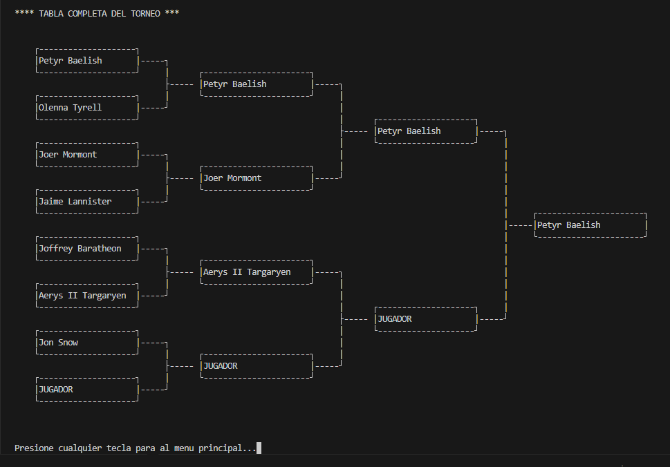
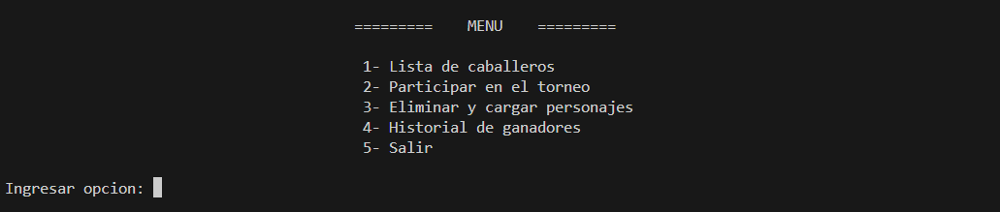

# La Justa

¡Bienvenido al torneo de justas de caballeros de Juego de Tronos!  
Enfréntate a los más valientes guerreros del reino, demuestra tu destreza, y con la bendicion de los siete avanzarás en el torneo.  
Solo los mejores prevalecerán. ¡Prepárate para la gloria y que el mejor caballero triunfe!

## Descripción del juego

"La Justa" es un juego de simulación de torneos de justas medievales.
El jugador puede participar en el torneo de justas y competir contra otros 7 caballeros del mundo de Juego de Tronos  
para convertirse en el campeón del torneo y quedar en la historia de campeones de poniente.

## Características

- El jugador puede crear y personalizar su propio caballero, eligiendo el nombre y la casa. Las características de su caballero se le asignan de manera aleatoria.
- Los caballeros compiten en combates por turnos, hasta 4 enfrentamientos por ronda.
- Los ganadores del torneo se guardan en un historial de campeones. Estan ordenados por la salud restantante despues del torneo y solo hay espacio para 10 ganadores.

## Menu de juego

El menú principal del programa ofrece varias opciones para el jugador:

1. **Lista de caballeros**:
   - Permite al jugador ver todos los caballeros de poniente a los que podria enfrentarse.
2. **Participar en el Torneo**:

   - El jugo selecciona de la lista de caballeros 7 contendientes de manera aleatoria y solicita el nombre del jugador junto a la casa a la que pertenece para comenzar el torneo.

   - Se presenta una tabla de cuartos de final en el que se podra ver con quien tocara luchar.

   - Inicia el torneo de justas con el caballero creado, enfrentándote a otros caballeros en combates por turnos.

   - En el caso de llegar a la final quedara registrado en el top 10 de ganadores de poniente

3. **Eliminar y cargar personajes**:
   - Permite eliminar la lista de los caballeros de poniente y crearlos de nuevo pero con nuevas caracteristicas.
4. **Ver Historial de Ganadores**:
   - Muestra una lista de los ganadores de torneos anteriores, ordenados por su salud en un top 10.
5. **Salir**:
   - Finaliza el programa despidiendose y cerrando el juego.

### Api usada para el juego

- Los nombres de los caballeros como asi sus casas fueron obtenidos de:
  https://github.com/shevabam/game-of-thrones-quotes-api
